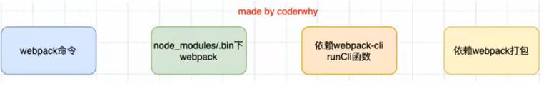
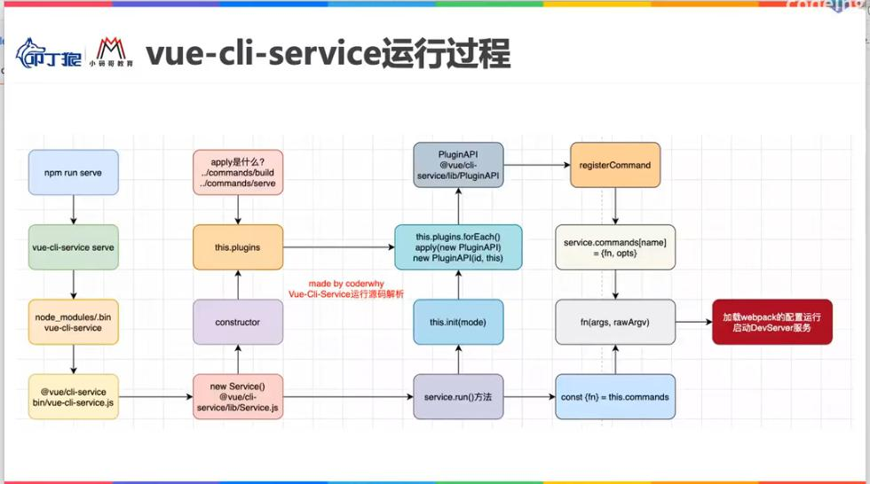

## 为什么需要webpack？
随着前端开发变得越来越复杂，开发一个应用往往会遇到以下问题：

1. 模块化开发是重要的前端开发思想，但是只有现代浏览器仅仅支持ESModule，并且需要在脚本script标签中声明属性type值为module；然而前端开发中有多种模块化方案可供选择，比如CommonJS和AMD、CMD等模块化方案浏览器是不支持的。使用webpack就可以将任意类型的模块化方案转化打包为浏览器可以识别的代码。

2. 使用诸多高级特性来提高开发效率和安全性，比如ES6+新特性、TS、less、sass等方式来提高开发效率，但是浏览器并不可以直接运行诸如ts代码、less、sass代码。

3. 在项目开发过程中，需要将代码的改变实时热更新到本地的浏览器上，这一点需要基于webpack来实现，可以大大提高开发效率。

4. 在项目开发中需要对项目的代码进行压缩、合并、代码优化等操作，而这些都需要基于webpack来实现。

## 什么是webpack？
webpack官网对其的定义是：一个用于现代JavaScript应用程序的静态模块打包工具。
> webpack is a static module bundler for modern JavaScript applications。

+ bundler打包：说明webpack就是专门用于打包的工具

+ static静态：说明webpack打包后的文件是静态文件，一般会被部署在web静态资源服务器上

+ module模块化：说明webpack默认支持各种模块化开发方案，并且可以将任意模块化方案在打包的时候最终转化为浏览器可以识别的js代码

+ modern现代：说明webpack是用于解决现在js应用程序开发中出现的问题


## webpack在脚手架之外还可以做什么？
前端三大框架的脚手架在创建新项目的时候，其实底层都是基于webpack来帮助我们的项目支持模块化、less、ts、打包、压缩等操作的，用Vue-CLI、create-react-app以及Angular-CLI创建的项目中都包含大量webpack配置相关的文件代码。除了基于脚手架创建一个项目之外，webpack还可以帮助我们做下面这些事情：

1. 给某些目录结构起别名
2. 让项目支持sass、less等css预处理器
3. 项目中手动添加TypeScript的支持
4. 对webpack做一些特殊的配置工作

在原有框架脚手架上定制一些自己项目的特殊配置来进行性能上的一些优化：
1. 安装性能分析工具
2. 使用gzip压缩代码
3. 引用cdn的资源，速度快减少项目体积
4. 公共代码抽取
5. 开发自己的loader和plugin：element-ui下的build文件夹下的md-loader

## webpack的官方文档
基于官方文档来学习细节，查漏补缺
升级之后最好的学习方式就是阅读官网文档
不止学到知识，更多是学习到如何学习官方文档并基于文档来解决问题

+ API 
当我们有一天想要自定义一个loader或者plugin的时候，就需要用到API页面的知识。

+ 概念
主要是webpack的核心概念

+ 配置
更加详细的对于webpack的配置

+ 指南
从0开始学习webpack就可以按照指南来逐步学习webpack

+ loader
查询每一个webpack的loader的用法和细节

+ plugin
查询每一个webpack的plugin的用法和细节

## webpack的依赖和安装
+ webpack所必须的依赖
webpack运行的前提是必须有node环境，node安装又会自带安装npm。

+ 安装webpack
webpack的安装自从4.0以来，目前需要安装两个依赖：webpack和webpack-cli。

webpack-cli主要用于在命令行中运行webpack，但是它并不一定是必须要安装的，比如使用vue脚手架创建的项目就没有安装webpack-cli，而是使用vue-cli-service来实现解析配置参数或者加载配置文件比如webpack.config.js的,这也正是webpack-cli最主要的功能。

```js
const webpack = require('webpack');
const compiler = webpack(config);
```

+ webpack和webpack-cli的关系
执行webpack命令，会执行node_modules/.bin目录下的webpack

webpack在执行的时候是依赖于webpack-cli中的runCli函数的，所以没有安装webpack-cli就会报错，常见的框架自带的脚手架之所以不安装webpack-cli运行webpack也不会报错，原因是其自身实现了相同功能的vue-cli-service之类的工具。

webpack-cli中代码执行的时候，才是真正利用webpack进行编译和打包的过程



+ 全局安装和局部安装
```bash
npm i webpack webpack-cli -g 全局安装
npm i webpack webpack-cli -D 局部安装

webpack -v
webpack 5.68.0
webpack-cli 4.7.2
```

## vue-cli-service运行过程


## 全局webpack的基本使用
- 进入项目的根目录，在命令行工具中输入webpack命令，此时webpack首先会找到src目录下的index.js文件，并将其当作打包的入口文件

- 打包完成之后，webpack会在根目录下新建一个dist文件夹，并将打包好的文件main.js文件放入该文件夹中

- 将dist/main.js文件引入到项目的index.html中，脚本就可以在浏览器中加载了

## 局部webpack的基本使用
一般项目中为了保证多人开发协作时的依赖库版本稳定性和一致性，都会新建一个package.json文件来声明当前项目中使用的依赖的版本号，webpack也不例外。

1. 在项目的根目录下使用npm init -y命令新建一个package.json文件

2. 使用npm i webpack webpack-cli -D命令在局部安装webpack和webpack-cli工具

在项目中安装好webpack之后如果直接在命令行中输入webpack，此时其实还是使用的全局webpack在进行打包，因为只要在终端输入webpack就默认优先查找全局webpack进行打包。为了避免这种情况，在项目中使用局部webpack打包有三种方法：

1. 终端执行./node_modules/.bin/webpack命令
2. 终端执行npx webpack，npx可以直接执行node_modules下的某个命令
3. 在package.json文件下的scripts项中新建一个build："webpack"命令，然后在终端执行npm run build，此时会优先去node_modules下的.bin文件夹中执行命令

