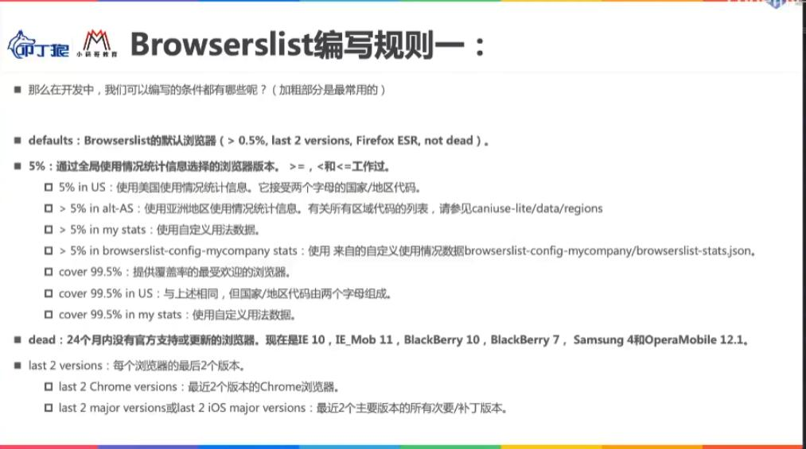
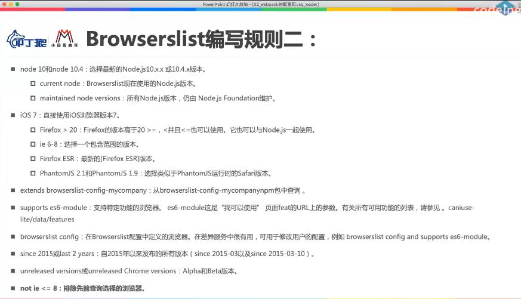

## 一、webpack默认打包
一般来说，对于安装了webpack和webpack-cli命令行工具的项目，可以直接在根目录的终端输入webpack的命令来对项目进行打包，前面说过这种直接在终端输入webpack命令的方法会导致优先使用的是全局安装的webpack来进行打包的，如果要实现使用局部的webpack打包，目前有三种方法：

1. 在根目录终端输入命令：./node_modules/.bin/webpack
2. 对于安装了webpack-cli工具的项目，直接在终端使用：npx webpack
3. 在package.json配置文件下的scripts脚本选项中配置命令项："build": "webpack"，然后在根目录终端运行：npm run build，此时会优先执行node_modules下的包，如果没有查到才会去全局查询。
```json
{
  "name": "webpack-demo",
  "scripts": {
	"build": "webpack"
  },
  "devDependencies": {
    "webpack": "^5.68.0",
    "webpack-cli": "^4.9.2"
  }
}
```

在执行打包命令之后，webpack会默认的去根目录下的src文件夹下查找index.js文件，将此文件当做入口文件，并依次查找相关模块依赖，最终编译打包后输出到dist文件夹下的main.js中,打包之后的main.js中的代码是被丑化压缩过的，并且依旧存在ES6的语法，这是因为默认情况下webpack并不会将ES6语法转化为低版本浏览器中可以运行的ES5语法，要实现这一需求，需要专门的babel工具来将ES6+代码转化为ES5语法。

有的时候我们并不一定要将src文件夹下的index.js文件当做打包入口，那么此时可以在终端运行命令，比如：
```bash
npx webpack --entry ./src/main.js --output-path ./build
```
上述代码表示：启动webpack打包的时候，以src目录下的main.js文件当做打包入口，并将打包后的代码输出到当前目录的build文件夹下。

如果觉得每次在终端输入命令麻烦，还可以在package.json的scripts脚本选项下配置：
```json
{
  "name": "webpack-demo",
  "scripts": {
	"build": "webpack --entry ./src/main.js --output-path ./build"
  },
  "devDependencies": {
    "webpack": "^5.68.0",
    "webpack-cli": "^4.9.2"
  }
}
```

> 更多webpack命令行工具的用法参见：文档-API-命令行接口(CLI)-Flags

## 二、webpack的配置文件
在实际的项目开发中，一般都会采用配置文件的方式来对webpack打包时的诸多选项进行配置。首先我们需要在项目的根目录下新建一个配置文件：webpack.config.js，然后将配置项依次写在里面，然后全部导出即可，比如基于配置文件来声明打包的入口文件和出口文件：

```js
const path = require('path');
module.exports = {
	entry:"./src/main.js",
	output:{
		filename:"bundle.js",
		path:path.resolve(__dirname,'./build');
	}
}
```
使用配置文件时要注意两点：
1. webpack.config.js文件是运行在node环境下的，所以使用的是CommonJS模块化规范
2. 指定打包文件出口的output的path路径必须是一个绝对路径，path.resolve(__dirname)方法可以获取当前文件所在目录的绝对路径，然后再拼接第二个参数的路径形成最终出口文件的绝对路径。
```js
path.resolve(__dirname);
C:\Users\克林辣舞\Desktop\webpack\webpack-demo

path.resolve(__dirname,'./build');
C:\Users\克林辣舞\Desktop\webpack\webpack-demo\build
```

## 三、自定义项目配置文件
在执行npm run build命令打包的时候，webpack会按照以下流程来确定打包的入口：

1. 查找根目录下是否存在webpack.config.js配置文件，如果有就按照配置文件信息来打包；
2. 如果没有配置文件，那么就查找src目录下的index.js当做打包入口进行打包

但是在实际的开发中，有的时候可能会专门新建一个config文件夹来存放各类配置文件，此时如果采用webpack默认的查找配置文件的方法是会报错的，要解决这一问题有两个方法：
1. 直接在终端执行命令
```bash
npx webpack --config ./config/webpack.config.js
```

2. 在package.json配置文件中的scripts脚本项中进行配置：
```json
{
  "name": "webpack-demo",
  "scripts": {
	"build": "webpack --config ./config/webpack.config.js"
  },
  "devDependencies": {
    "webpack": "^5.68.0",
    "webpack-cli": "^4.9.2"
  }
}
```

## 四、webapck依赖图(dependency graph)

1. 什么是webapck依赖图?
webpack在对应用程序打包的时候，无论是基于类似--entry的命令还是基于配置文件，都会首先确定打包的入口文件;在找到入口文件之后，webpack就会递归的构建一个依赖关系图(图是一种数据结构),这个依赖关系图包含了应用程序中所需要的所有模块，包含js、css、图片、字体等;然后将所有模块基于不同的loader来解析后打包为最终的bundle文件，这个文件是可以被浏览器加载的。

所以如果一个文件自始至终没有存在于依赖图中，那么该文件是不会被打包的。

2. tree shaking
如果一个文件存在于依赖图中但是该文件中声明的函数或者变量没有被使用，那么在打包的过程中webpack会使用tree shaking特性，将未使用的代码不进行打包，只打包那些使用的代码。

## 五、认识loader及配置方式
当我们在一个js文件中引入一个css文件之后执行打包操作，此时webpack会报错，报错信息为：
```js
You may need an appropriate loader to handle this file type, currently no loaders are configured to process this file. 
```
意思是提示我们需要找到一个合适的loader来加载这个css文件，因为webpack默认只可以处理js、ts以及json文件，其他类型的文件webpack在打包的时候并不知道该如何处理，此时loader就派上用场了。

### loader是什么？
loader英文翻译过来是“载入程序”的意思，在webpack中的loader可以实现对于模块的源代码进行替换，正是基于这一原理，可以将webpack原本不识别的css文件基于css-loader处理为可以识别的文件。

### loader的3种配置方式
1. 内联方式
可以直接通过在import语句中直接指定当前导入资源所需的loader，以css文件为例：通过感叹号!来声明loader名称，多个loader用！依次隔开即可。
```js
import "css-loader!style-loader!./css/index.css"
```

2. CLI命令行方式(v4还在使用，v5版本已经废弃)
--module-bind 'css=css-loader'
```json
{
  "name": "webpack-demo",
  "scripts": {
	"build": "webpack --config ./config/webpack.config.js --module-bind 'css=css-loader' "
  },
  "devDependencies": {
    "webpack": "^5.68.0",
    "webpack-cli": "^4.9.2"
  }
}
```

3. 基于webpack.config.js配置文件来声明.
+ module.rules选项中允许我们配置多个不同的loader，这种配置的方式便于管理和维护，推荐使用
+ rules属性的值是一个数组，数组中的每一个对象被称之为Rule对象，每一个Rule对象中可以设置多个属性来配置loader使用规则：
	- test属性：一般情况下值为正则表达式，专门用于匹配不同的资源；
	- use属性：
		1.值为一个数组的时候，数组中每一项又是一个对象，被称之为UseEntry对象，每一个UseEntry对象中又有一些属性，用于配置laoder：
			a：loader属性:必须属性，对应的值是一个字符串也就是loader名称
			b：options属性：可选属性，值是一个字符串或者对象，值会传入到loader中
			c：query属性：目前在v5中已经被options属性取代
		2.值为一个字符串的时候，如use:['css-loader']就等价于：use:[{loader:'css-loader'}]
	- loader属性：值为一个字符串，一般只有单个loader的时候可以这样写，其实本质也就是use:[{loader:'css-loader'}]的简写。
```js
module.exports = {
	entry: "./src/main.js",
	output: {
		filename: "bundle.js",
		path: path.resolve(__dirname, '../build')
	},
	module: {
		rules: [
			/* 写法一 */
			{
				test: /\.css$/, // 匹配规则
				loader: "css-loader"
			},
			
			/* 写法二 */
			{
				test: /\.css$/, // 匹配规则
				use: [{
					loader: "css-loader"
				}]
			},
			
			/* 写法三 */
			{
				test: /\.css$/, // 匹配规则
				use:["css-loader"]
			},
		]
	}
}
```

### 不同场景下配置loader的不同选择
通过webpack.config.js文件来配置loader的时候，我们已经知道有三种不同的写法，但是一般遵循下面的配置规则：
1. 如果只有一个loader且没有options配置项
```js
{
	test: /\.css$/, // 匹配规则
	use:["css-loader"]
}
// 或者
{
	test: /\.css$/, // 匹配规则
	loader:"css-loader"
}
```

2. 如果有多个loader但是都没有options配置项,直接以字符串简写的方式依次声明
```js
{
	test: /\.css$/, // 匹配规则
	use:["css-loader","style-loader"]
}
```

3. 如果有多个loader并且需要options配置项，必须采用对象写法来声明
```js
{
	test:/\.css$/,
	use:[
		{loader:"css-loader",options:{}},
		{loader:"style-loader",options:{}}
	]
}
```

### 多loader的加载顺序
以css-loader和style-loader为例，配置在use数组中的loader加载顺序不是我们想当然的从前向后依次加载的，比如使用webpack来加载css文件,如果按照如下声明方式会报错，报错原因是：因为css-loader只负责将css文件进行解析，并不会将解析后的css文件插入到页面中。所以要想样式生效还需要一个style-loader来将解析好的css插入到页面中。但由于use数组中loader加载顺序是从后向前依次加载的，所以下面的配置就等于先插入css然后解析，顺序就反了。
```js
{
	test: /\.css$/, // 匹配规则
	use:["css-loader","style-loader"]
}
Module build failed (from ./node_modules/css-loader/dist/cjs.js):CssSyntaxError
```
正确的做法是先解析css，然后再将解析后的css加载到页面中：
```js
{
	test: /\.css$/, // 匹配规则
	use:["style-loader","css-loader"]
}
```

### style-loader的内部原理
style-loader的原理是先使用js创建一个style标签，然后将css-loader解析好的css代码插入到这个style标签内部，最后将这个style标签插入到页面的head标签中,样式就会生效。

## 六、less-loader的处理
在项目中我们会使用less、sass、styles等CSS预处理语言来编写样式文件，因为这相比于css文件可以更加高效和便捷，但是浏览器并不能直接识别这些css预处理语言，这中间less文件和如何被转化为css并最终被浏览器加载的呢？

### less文件是基于less工具转化为css的
首先less文件转化为css文件，所使用的其实是一个less工具，这和webpack是没有关系的，在webpack中使用的less-loader在处理less文件的时候，本质也是去加载这个less包并执行对应的命令将less转化为css:
```bash
npm i less -D
npx less ./src/css/component.less > ./src/css/component.css
```

必须先安装less包，然后执行如下命令:执行该命令代表着会去node_modules下的.bin文件夹中查找一个名为lessc的包，然后对less文件进行编译，将其转化为对应的css文件。
```bash
npx less 要转化的less文件路径 > 转化后的css文件路径
```

### 如何配置来处理less文件
可以将处理less文件的过程看做一个流水线：
1. 首先基于less-loader自动执行npx less 命令将less文件转化为css文件；
2. 然后将css文件通过css-loader进行处理解析；
3. 最后通过style-loader将处理后css文件插入到页面的head中让样式生效
```js
{
	test:/\.less$/,
	use:[
		"style-loader",
		"css-loader",
		"less-loader"
	]
}
```


## 七、前端工程化中浏览器兼容性的问题
在前端开发中，浏览器的兼容性问题一直是一个比较重要的问题，这里的浏览器兼容性指的是：
1. 不同厂商的浏览器对于不同的css特性和js语法的支持情况不同；
2. 同一厂商的不同版本的浏览器对于不同的css特性和js语法的支持情况不同；

以往我们解决一个css样式在不同浏览器中的兼容性的时候，会通过加上浏览器前缀的方法来解决：
```css
div {
   -webkit-transition-delay: time;
   -moz-transition-delay: time;
   -ms-transition-delay: time;
   -o-transition-delay: time;
   transition-delay: time;
}
```
为了避免我们在多个地方都这样加浏览器前缀的方法来解决兼容性问题，就出现了autoorefixer工具用于自动加上兼容性的浏览器前缀，还有比如babel工具将高版本的js语法转化为低版本浏览器也可以识别的代码。

但是这里有一个问题：那就是现在市面上的浏览器有很多，厂商很多并且版本也很多，诸如autoorefixer工具、babel这些前端工具难道需要为所有厂商和版本的浏览器都进行适配么？答案是否定的。

日常通过前端框架搭建的项目中就有一个文件叫做.broswerslistrc，这个文件中定义了以下规则：

```js
> 1%
last 2 versions
not dead
```

还有比如使用React项目脚手架搭建的项目中的package.json文件中会有一项配置：
```js
module.exports = {
	"browserslist":[
		"> 1%",
		"last 2 versions",
		"not dead"
	]
}
```

### 这些配置信息是做什么的呢？
每一条配置信息其实都是一个个的查询浏览器的条件，这些查询条件会提供给诸如autoorefixer和babel这些工具，告诉这些工具当前项目到底需要适配哪些浏览器。

比如"> 1%"这个条件就告诉autoorefixer和babel这些工具，当前项目所要适配的浏览器是市场占有率大于1%的浏览器：
+ 如果某个浏览器市场占有率大于1%，并且这个浏览器还暂时不支持ES6+等新特性，那么babel工具将ES6+语法转化为ES5语法，以便于这个浏览器来适配。
+ 如果某个浏览器市场占有率小于1%，那么babel不用工作，因为这些浏览器不属于此项目的适配浏览器范围。

### 浏览器的市场占有率
但是这时候又有问题来了，应该怎么查询到哪些浏览器的市场占有率大于1%呢？

目前浏览器最官方权威的数据来自于caniuse网站[caniuse](https://caniuse.com/usage-table)，在caniuse网站的usage-table这个页面就展示了当前市场上所有浏览器的市场占有率数据。


### 认识browserslist工具
现在又有新的问题：比如我设置了一个条件：> 1%，其实表达的意思是：
+ 这个项目中的css要兼容市场占有率大于1%的浏览器
+ 这个项目中的js语法要兼容市场占有率大于1%的浏览器

1. 以上要求我们要如何才能实现呢？
所幸现在前端工程化的程序非常高，已经有了autoorefixer、babel、postcss-preset-env这些工具，基于这些前端工程化的工具就可以解决本项目浏览器兼容性的问题。

2. 但是要如何让这些工具都能共享此项目关于浏览器条件查询的配置呢？
答案是Broswerslist工具:*它是一个专门用于在不同的前端工程化工具之间，共享目标浏览器和nodejs版本配置的工具，它本身也是一个工具。*

3. Broswerslist工具使用注意事项
Broswerslist这个工具单独是没有任何用的，在Vue脚手架创建的项目中，browserslist字段中声明的查询条件会被其搭配的工具比如Autoprefixer和@babel/preset-env用来确定哪些浏览器的js特性需要被转译以及哪些css样式需要添加对应的浏览器前缀，Broswerslist工具搭配的常见的工程化工具有：
+ Autoprefixer
+ Babel
+ postcss-preset-env
+ eslint-plugin-compat
+ postcss-normalize
+ stylelint-no-unsupported-browser-features

4. 使用vue-cli创建项目的时候会讯问是想将配置信息做一个单独的文件还是写在package.json中，这里选择的不同就会导致browserslist配置信息的位置不同

5. autoprefixer现在已经在postcss-preset-env中被内置了

6. webpack在安装的时候就自动安装browserslist和caniuse-lite这两个包，当前端工具在工作的时候就会自动读取到browserslist工具的配置文件中的查询条件，然后启动caniuse-lite工具来查询到具体的浏览器版本。

7. 在终端输入npx browserslist命令之后
+ 先查找到项目中是否存在.browserslistrc文件或者package.json文件中的browserlist字段，如果有就读取其配置信息并启动caniuse-lite工具进行查询，并在控制台进行打印;
+ 如果以上两个地方都没有找到，那么就会采用默认查询条件的配置，也就是等于npx browserslist defaults如下所示，并将查询结果打印出来。
```js
> 0.5%
last 2 version  // 每个浏览器的最后2个版本
Firefox ESR  // 最新的Firefox ESR版本 
not dead // 24个月内任然有官方支持或者更新的浏览器
```
### browserslist的编写规则
其他更多编写规则见下图：



现在browserslist这个工具的查询规则配置好之后，该去那个地方查询符合条件的浏览器版本呢？
其实browserslist配置中的条件查询是基于caniuse这个网站提供的一个小工具：caniuse-lite来实现的.
在终端输入命令：npx browserslist defaults，便打印出了很多符合默认查询条件的浏览器版本，如下所示:

```js
npx browserslist defaults
and_chr 97
and_ff 96
and_qq 10.4
and_uc 12.12
android 97
baidu 7.12
chrome 98
chrome 97
chrome 96
edge 98
edge 97
edge 96
firefox 96
firefox 95
firefox 91
firefox 78
ie 11
...
```
这就意味着当我们在项目中的.broswerslistrc文件或者package文件中配置了适配的浏览器条件为defaults的时候，其实css和js适配的就是上面这些浏览器版本。配置broswerslist的地方有两个：
1. 单独新建一个.broswerslistrc文件
2. 在package.json文件中配置
如果这两个地方都没有配置的话，那么就认定为默认配置defaults：
```js
// default broswer query
">0.5%"
"last 2 version"
"FireFox ESR"
"not dead"
```

### 多个配置条件的关系
1. 多个条件用or或者逗号隔开的时候，或者换行也代表并集。意思每个条件满足的浏览器都会被选中：
```js
"browserslist":["> 1%","last 2 versions"]
"browserslist":["> 1%" or "last 2 versions"]
```

2. 多个条件用and连接代表交集，也就是多个条件同时满足的浏览器才会被选中：
```js
">0.5%"
"and last 2 version"
"and FireFox ESR"
```
3. 条件之前有not代表取反，意思是此条件满足的浏览器都不可以被选中
```js
">0.5%"
"and last 2 version"
"not dead"
```


