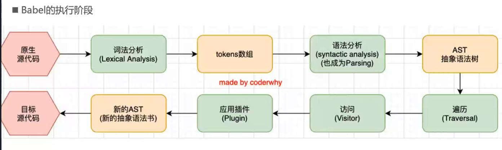
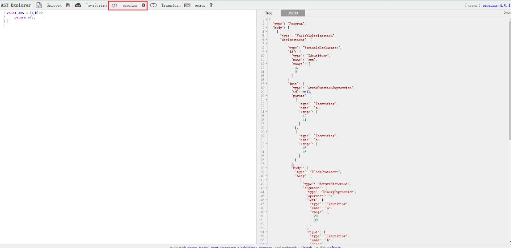

## Babel是什么
在当前的前端项目开发中，虽然我们不会直接的去接触Babel，但是Babel在整个前端工程化中起着非常重要的作用,比如：
1. 开发中使用的ES6+语法需要Babel
2. 开发中使用的TypeScript语法需要Babel
3. 开发React项目时的JSX语法都需要Babel

#### 那么Babel究竟是什么呢？
Babel的官方文档对其的描述是：Babel是一个JavaScript编译器，也可以说Babel是一个工具链。
Babel主要用于将采用ES6+语法编写的代码转换为向后兼容的JavaScript语法代码，以便于能够运行在当前和旧版本的浏览器或者其他环境中。

#### Babel可以做哪些事情？
1. 语法转化，比如将ES6+语法转化为ES5语法
2. 源代码转化，比如将JSX的源码转化为ES5语法
3. 通过Polyfill方式在目标环境中添加缺失的特性

## Babel的命令行工具
Babel本身就可以作为一个独立的工具使用而不借助于webpack等构建工具，如果要单独使用Babel做一些转化工作，那么就需要安装Babel的核心库和命令行工具。
```bash
npm i @babel/core -D  安装Babel的核心库，必须安装
npm i @babel/cli -D   安装Babel的命令行工具，这是通过命令行单独使用Babel的前提
```

现在需要将index.js的如下ES6代码通过Babel命令行的命令将其转化为ES5语法
```js
// src/index.js
const sum = (a,b)=>{
	return a+b;
}
```

在命令行工具中输入命令：代表通过babel工具将./src/index.js文件中的代码转化之后输出到当前目录下的dist文件夹中
```bash
npx babel ./src/index.js --out-dir dist
```

但是，通过上述命令转化之后代码并没有被转换：
```js
// dist/index.js
const sum = (a, b) => {
  return a + b;
};
```
这是因为Babel和PostCSS工具有点类似，Babel本身并不对代码进行任何转化，真正实现转换代码的是Babel的插件plugin，比如我们这里需要将箭头函数转化为普通函数，就需要先安装Babel专门用于转化箭头函数的插件@babel/plugin-transform-arrow-functions:
```bash
npm i @babel/plugin-transform-arrow-functions -D
```

安装完成之后再次执行命令，不过这次需要带上插件：--plugin参数代表在编译过程中需要执行的插件
```bash
npx babel ./src/index.js --out-dir dist --plugins=@babel/plugin-transform-arrow-functions
```

转化完成之后发现箭头函数已经被转化为普通函数，但是const这种声明变量的写法依旧没有被转化:
```js
const sum = function (a, b) {
  return a + b;
};
```

此时就要用到另外一个插件：@babel/plugin-transform-block-scoping，安装该插件并执行命令：
```bash
npm i @babel/plugin-transform-block-scoping -D
```

再次执行babel命令：
```bash
npx babel ./src/index.js --out-dir dist --plugins=@babel/plugin-transform-arrow-functions,@babel/plugin-transform-block-scoping
```

发现const和箭头函数都被转化为ES5语法：
```js
var sum = function (a, b) {
  return a + b;
};
```

## Babel的预设preset
我们思考一个问题，在实际的开发中我们可能写各种ES6+语法来开发项目，难道我们每一个都需要手动下载对应的插件然后使用么？幸好babel官方为我们提供了babel转化的预设(preset)。一个预设可以看做是一个整合了多个插件的集合，就不用我们一一去配置插件。

使用Babel预设的前提是安装@babel/preset-env包：
```bash
npm i @babel/preset-env -D
```

还是用上面的例子，我们直接执行babel命令并使用预设：
```bash
npx babel ./src/index.js --out-dir dist --presets=@babel/preset-env
```

可以直接完成转化：
```js
"use strict";

var sum = function sum(a, b) {
  return a + b;
};
```

## Babel的底层原理
Babel的官方文档说Babel是一个JavaScript的编译器。一般来说，编译器都有下面三个流程用于将源代码转化成为目标代码：
1. 解析阶段Parsing:将源代码解析为AST抽象语法树
2. 转换阶段Transformation：遍历抽象语法树将其转化为新的抽象语法树
3. 生成阶段Code Generator：生成目标代码

那么Babel作为JavaScript的编译器，是如何将诸如ES6+、JSX等这些源代码，转化为浏览器可以直接识别的目标代码的呢？
其实Babel在编译的过程中也具有以上三个阶段，详细的Babel编译器工作原理如下图所示：


### 解析源代码阶段Parsing

1. 词法分析Lexical Analysis
babel首先会对当前要转换的源代码中的每一个token做一个词法分析，token也就是代码中的最小单元，比如变量、标点符号、运算符等。经过词法分析之后会生成一个tokens数组。
比如下面源代码经过词法分析之后生成的tokens数组：
```js
// babel转换前的源代码
const sum = (a,b)=>{
	return a+b;
}

// 经过词法分析阶段生成的tokens数组
[
	{
		"type":'Keyword',    // 表示类型是一个关键字，值为const
		"value":"const"
	},
	{
		"type":'Identifier',  // 表示类型是一个标识符，值为sum
		"value":"sum"
	},
	{
		"type":'Punctuator',  // 表示类型是一个标点符号，值为（
		"value":"const"
	},
	...
]
```

2. 语法分析Syntacic Analysis(也称为Parsing)
babel将上一步词法分析之后生成的tokens数组进行语法分析，在经过语法分析之后会在此阶段生成一个AST抽象语法树，在这一步将计算机原本不易识别的源代码转换成了计算机易于识别和处理的树结构，根据上面的tokens生成的AST可以在下面这个工具中进行查看：
[工具Esprima:它是一个ECMAScript解析器](https://astexplorer.net/)


### 转换源代码阶段Transformation
3. 遍历Traversal + 访问Visitor + 应用插件Plugins
对上一步生成的抽象语法树上的每一个节点进行深度优先的遍历，在遍历的过程中就会去访问每一个节点，在访问的过程中基于插件提供的功能对节点进行修改，在全部访问完成之后就会生成一个新的AST抽象语法树。

### 生成阶段Code Generator
基于上一步生成的新的AST抽象语法树生成转换之后的代码，至此babel的工作完成，已经将转换前的ES6代码转换为ES5的代码。

### github关于babel工作流程的手写代码
[babel工作流程](https://github.com/jamiebuilds/the-super-tiny-compiler/blob/master/the-super-tiny-compiler.js)

## 在webpack中配置babel-loader
webpack在打包的过程中只会按照模块的互相依赖关系进行打包，并不会对打包前的源代码进行一个转换的工作，而如果要在项目中集成将打包前的源代码转化成为ES5语法的代码，就需要在webpack打包过程中针对不同的文件，比如ts、js等类型文件配置babel-loader，将打包前的高级语法转化为目标浏览器可以识别的语法。

### 配置babel-loader
1. 安装babel核心@babel/core、babel预设插件集@babel/preset-env以及babel-loader
```bash
npm i @babel/core @babel/preset-env babel-loader -D
```

2. 在webpack.config.js中进行配置
> 注意：单独配置一个babel-loader是无效的，必须要针对不同的文件配置对应的预设preset或者插件来对源代码进行转换
```js
module.exports = {
	module:{
		rules:[
			{
				test:/\.js$/,
				use:{
					loader:"babel-loader",
					options:{
						presets:["@babel/preset-env"] // 要想babel生效，必须要配置转化的插件，这里用的是babel官方出品的插件集合
					}
				}
			}
		]
	},
}
```

### 指定Babel-loader的目标浏览器配置
如果我们在应用babel-loader的时候配置了预设@babel/preset-env，那么此时有一个问题需要考虑：Babel在对源代码进行转换的时候，到底要对那些代码应用插件来转换代码？因为现实的情况是打包之后的代码可能运行在不同品牌和不同版本的浏览器中，但是Babel打包后的代码是不可能对市面上的所有浏览器都进行兼容的，所以这里就有一个Babel最终转换后代码应用在哪些目标浏览器的问题。

其实Babel和之前的PostCSS一样，都是一个工具链，它本身不会对代码进行转换，真正的起到转换作用的是其内部的插件。而插件具体要针对哪些目标浏览器进行代码转化，一般来说有两个来源：
1. 基于项目根目录下的.browserlistrc文件中的查询条件，调用caniuse工具去caniuse网站进行查询，将查询之后的目标浏览器结果返回
```js 
// .broswerlistrc
>1%
last 4 version
not dead
```
2. 在配置babel-loader的时候为预设插件集传入targets属性直接指定目标浏览器
```js
module.exports = {
	module:{
		rules:[
			{
				test:/\.js$/,
				use:{
					loader:"babel-loader",
					options:{
						presets:[
							["@babel/preset-env",{
								targets:['chrome 88'] // 代表应用插件时只需要考虑目标浏览器为chrome 88版本即可
							}]
						] 
					}
				}
			}
		]
	},
}
```

### 配置目标浏览器的优先级问题
一般情况下推荐在项目根目录下新建.broswerlistrc文件指定，但是如果在配置loader的时候手动指定了插件的targets参数，那么以targets参数指定的目标浏览器版本为主。
源代码在同时配置了.broswerlistrc文件和targets参数之后的打包结果，可以看出是以targets参数为主：
```js 
// 源代码
const CommonSum = (a,b)=>{
	return a+b;
}


// 只有.broswerlistrc文件
var CommonSum = function CommonSum(a,b){
	return a+b;
	}
}

// 同时有.broswerlistrc文件和targets参数 因为chrome88已经支持了ES6语法 所以无需转换
const CommonSum = (a, b) => {
  return a + b;
};

```

### 在babel6版本中配置stage-x的预设
在babel7以前，在配置babel-loader的时候经常会看到这种写法：
```js
module.exports = {
	module:{
		rules:[
			{
				test:/\.js$/,
				use:{
					loader:"babel-loader",
					options:{
						presets:[
							["stage-3"]
						] 
					}
				}
			}
		]
	},
}
```
这个预设集合中的stage-3是对应的bable-preset-stage-3这个包的简写，那么它到底代表什么意思呢？
stage-X是TC39技术委员会规定的一种分不同阶段来对加入的新的语言特性进行标识的方法，stage后面的x可以代表0-4这5个数字：
1. stage-0：尚未进入正式提案的讨论、想法或者一些补充都被认为是第0阶段
2. stage-1：提案已经被正式化，但是还需要观察和其他提案的互相影响
3. stage-2：草稿阶段，stage-2阶段的提案应该提供规范的初稿和草稿，此时语言的实现者开始观察其在runtime中的具体实现是否合理
4. stage-3：候补阶段，这个阶段的提案已经不会有太多的变化，对外正式发布前只进行简单的修正
5. stage-4：正式阶段，进入到这个阶段的提案会在ECMAScript的下一个版本中进行发布。

所以babel-loader中对于stage-3预设的配置意思就是对所有已经进入到候补阶段的语法特性进行转换，但是babel7中已经不建议这种写法了，而是建议使用@bable/preset-env来替代。

## Babel的配置文件
在webpack.config.js中配置babel-loader的时候有一个问题，那就是我们需要对每一种需要转换的文件格式都配置一次，比如项目中同时有js和ts文件的话，就需要像下面这样配置两次：
```js
module.exports = {
	module:{
		rules:[
			{
				test:/\.js$/,
				use:{
					loader:"babel-loader",
					options:{
						presets:["@babel/preset-env"] 
					}
				}
			},
			{
				test:/\.ts$/,
				use:{
					loader:"babel-loader",
					options:{
						presets:["@babel/preset-env"] 
					}
				}
			}
		]
	},
}
```
很显然，这种重复的配置是不合理的，所以babel可以让我们将关于babel的一系列配置信息统一放在一个独立的文件中进行配置，然后项目中只要用到babel的地方都去共享这个配置即可。
目前有两种专门用来配置babel的独立文件：
1. bable.config.json(后缀名还可以是js、cjs、mjs)
对于多包管理的项目，比如babel、umi、element-plus等推荐使用这种配置方式，因为可以直接作用于Monorepos项目的子包，babel7中也更加推荐使用此配置文件。

2. .babelrc.json(也可以简写为.babelrc，后缀名还可以是js、cjs、mjs)
早期使用较多的配置，如果项目是多包管理的项目推荐此配置文件。

```js
// 以babel.config.json文件为例
module.exports = {
	presets: [
		["@babel/preset-env", {
			targets: 'chrome 88'
		}]
	]
}

// webpack.config.js中无需再重复配置presets了
module.exports = {
	module:{
		rules:[
			{
				test:/\.js$/,
				use:{
					loader:"babel-loader",
				}
			},
			{
				test:/\.ts$/,
				use:{
					loader:"babel-loader",
				}
			}
		]
	},
}
```

## 在babel中使用polyfill

### 1. 认识polyfill
polyfill的字面意思是：一种用于衣物、床具的聚酯填充材料，可以让这些物品更加温暖属实。
polyfill在前端工程化中的意思可以理解为一个垫片或者补丁，可以帮助我们更好的使用JavaScript。

### 2. 为什么需要polyfill
在使用polyfill之前，需要考虑一个问题：为什么已经配置了babel的预设preset-env，还需要polyfill?
这是因为babel的预设preset-env只是一个插件的集合，它提供了很多将ES6+语法新特性转化的插件，比如当我们在代码中使用了const、箭头函数的时候，在打包之后就可以将其转化为var和function函数声明的写法，这样就可以更加好的在目标浏览器中进行运行。但是如果我们使用了以下新特性：
+ Promise类
+ Symbol数据结构
+ Array.prototype.includes()实例方法
+ ...

那么就算在使用babel-loader的时候配置了预设preset-env，但是打包之后的代码并不会发生转化，如果打包之后的代码运行在低版本浏览器的时候，就会报错，比如：
```js
// 这是打包前的代码，使用了Promise类生成一个实例处理异步需求
function getData(){
	return new Promise((resolve,reject)=>{
		setTimeout(()=>{
			resolve('1s之后返回数据')
		},1000)
	})
}

getData().then(res=>{
	console.log(res);
})
```
将上面代码进行打包npm run build之后发现打包之后的bundle.js中代码并未发生变化,为了解决这个问题，我们就可以使用polyfill来为打包后的代码打一个补丁，就拿这个例子来说打包后的代码中就会包含实现了Promise类的补丁，如果当前的代码运行环境中没有实现Promise类那么就会使用这个Promise类的补丁，以防止代码运行报错。

### 3. 在babel@7.4+中直接使用@bable/polyfill的问题
在babel7.4.0版本以前，我们在配置@babel/preset-env的时候使用@babel/polyfill这个包就可以了,但是在babel7.4.0版本发布之后官方已经不推荐使用@babel/polyfill这个包了：
```bash
npm i @babel/polyfill -S  
```
注意：polyfill代码最终会在生产环境使用，所以这里应该是生产依赖而不是一个开发依赖，虽然安装成为开发依赖webpack在打包的过程中也会按照模块的依赖关系全部打包进去，但是为了规范起见这里安装成为生产依赖，也就是--save，或者-S都可以。

但是在安装@babel/polyfill的时候会抛出2个警告：
```js
// babel/polyfill这个包已经被废弃了，如果你需要的话请单独安装core-js和regenerator-runtime这两个库
This package has been deprecated in favor of separate inclusion of a polyfill and regenerator-runtime (when needed).

// core-js小于3.4的版本由于问题太多不再建议使用了，请将其升级到core js的实际版本。
deprecated core-js@2.6.12: core-js@<3.4 is no longer maintained and not recommended for usage due to the number of issues. Because of the V8 engine whims, feature detection in old core-js versions could cause a slowdown up to 100x even if nothing is polyfilled. 
Please, upgrade your dependencies to the actual version of core-js.
```

这是因为@babel/polyfill这个包其实就是由两个包构成的，一个core-js，一个regenerator-runtime。但是如果我们直接安装@babel/polyfill的话就会有两个问题：
1. @babel/polyfill包里面的core-js版本是2.6.12，它小于3.4版本，core-js官方警告我们问题太多不要再使用了
2. @babel/polyfill这个包在babel7.4.0之后已经被废弃了，如果要使用polyfill需要我们单独安装core-js和regenerator-runtime，然后按照官方文档在使用babel-loader的时候进行配置即可。
### 4. 在babel@7.4+版本中配置polyfill
根据以上的警告和提示，加上我们当前使用的babel版本是7.17也就是大于7.4的，所以我们根据提示分别安装core-js大于3.4的版本以及regenerator-runtime这两个库。
#### 1. 必须要安装的依赖
```bash
npm i core-js regenerator-runtime -S    //生产依赖
```

#### 2. 基于不同需求配置
在配置polyfill之前说明一个问题，所有关于polyfill的配置都是基于babel当前指定的预设来配置的，也就是说源代码在使用babel-loader进行转换的时候，需要根据配置的预设preset-env中插件的规则和brswerlist提供的打包之后要运行在哪些目标浏览器上这两个信息来进行代码的转换，如果配置的目标浏览器是最新版本的，它的js解析引擎已经实现了Promise这些新特性，那么就无需在源代码打包的时候为代码提供polyfill补丁了。

配置polyfill主要是对useBuiltIns这个属性来分配不同的值来实现的，useBuiltIns的意思是哪些新特性需要在构建的时候包含进去，它主要接收三个值：

##### 1. false 
false代表在使用babel-loader转换代码的时候不使用任何polyfill补丁,打包之后的代码不会引入polyfill来进行适配
```js
module:{
	rules:[
		{
			test:/\.js$/,
			use:{
				loader:"babel-loader",
				options:{
					presets:[
						["@babel/preset-env",{
							useBuiltIns:false  // 注意false是布尔值，不是字符串"false" 否则会打包失败
						}]
					]
				}
			}
		}
	]
},
```
##### 2. usage 
usegae代表在使用babel-loader转换代码的时候根据源代码中使用了那些新的语言特性，自动检测所需要的polyfill并引入
好处:可以确保最终打包后的代码中polyfill数量的最小化，打包的体积较小
注意：但是要注意使用usage的时候需要指定对应的core-js的版本，比如当前安装的core-js版本是3.21，就应该指定为3.21
缺点：在使用usage的时候可能会出现当前项目中使用的第三方库中已经实现过一遍关于polyfill的引入了，如果在我们自己的项目代码中再次实现一遍polyfill的按需引入的话，可能会导致冲突的发生，所以我们还需要配置一个exclude字段来排除第三方库的polyfill，让它和我们的实现隔离。
```js
module:{
	rules:[
		{
			test:/\.js$/,
			exclude:/node_modules/, // bable不会对node_modules文件夹下的代码在打包的时候使用babel进行转换
			use:{
				loader:"babel-loader",
				options:{
					presets:[
						["@babel/preset-env",{
							useBuiltIns:"usage",,
							corejs:"3.21" // corejs主要不要写成core-js
						}]
					]
				}
			}
		}
	]
},
```
使用usage之后bundle.js中的代码为2000多行，并且里面有关于Promise类的实现，说明关于Promise的polyfill补丁已经生效：
```js
// bundle.js 截取一部分关于function Promise实现的代码
PromiseConstructor = function Promise(executor) {
    anInstance(this, PromisePrototype);
    aCallable(executor);
    call(Internal, this);
    var state = getInternalState(this);

    try {
      executor(bind(internalResolve, state), bind(internalReject, state));
    } catch (error) {
      internalReject(state, error);
    }
  };

```

##### 3. entry 

entry代表在使用babel-loader转换源代码的时候导入所有的polyfill，不管项目代码中是否有用到，这会导致项目打包之后的体积变得很大。
注意:当值为entry的时候，必须要在项目的入口文件处手动导入我们之前安装的core-js/stable和regenerator-runtime/runtime两个包，如果不导入那么等于传入了false，如下:
```js
// 项目入口文件main.js
import "core-js/stable";
import "regenerator-runtime/runtime"
```

在入口文件处导入之后在config文件中进行配置：
```js
module:{
	rules:[
		{
			test:/\.js$/,
			exclude:/node_modules/, // bable不会对node_modules文件夹下的代码在打包的时候使用babel进行转换
			use:{
				loader:"babel-loader",
				options:{
					presets:[
						["@babel/preset-env",{
							useBuiltIns:"entry",,
							core-js:3.21
						}]
					]
				}
			}
		}
	]
},
```
使用usage之后bundle.js中的代码为17000多行，并且里面有关于Promise类的实现，说明关于Promise的polyfill补丁已经生效,可以发现包的体积增大了8倍左右。

### 5. 使用Plugin-transfrom-runtime插件来实现polyfil
在前面我们通过useBuiltIns配置来引入的polyfill都是全局的，但是如果当前要开发一个第三方工具库，在开发这个库的时候需要用到polyfill，那么如果我们还是采用之前的useBuiltsIns来进行配置，配置过后的polyfill会被添加到全局，其他人在使用我们开发的第三方库的时候，这个库里面引入的polyfill代码可能会对使用者的代码进行污染。

为了解决这个问题，babel推荐我们在开发第三方库的时候使用一个插件：@babel/plugin-transform-runtime，这个插件所导入的polyfill不会被添加在全局上。

#### 1. 安装依赖
使用此插件需要安装3个库：
1. @babel/plugin-transform-runtime
2. @babel/runtime (babel里面本来就有)
3. @babel/runtime-corejs3 因为使用polyfill的时候需要安装core-js，我们安装了corejs3版本，所以还需要安装这个库来适配
```js
npm i  @babel/plugin-transform-runtime -D
npm i  @babel/runtime -S
npm i  @babel/runtime-corejs3 -S
```

#### 2. 配置插件
注意：此插件是bable的插件，所以要配置在babel-loader的配置项中的plugins，而不是全局的plugins
注意：使用插件@babel/plugin-transform-runtime和useBuiltIns选项不可以同时存在，两者选一个。一般来说开发第三方库用@babel/plugin-transform-runtime，开发项目使用useBuiltIns选项来导入polyfill。
注意：在使用@babel/plugin-transform-runtime的时候还需要指定使用的corejs的版本，并且需要安装对应的库。
	+ 如果corejs值为false，npm install --save @babel/runtime
	+ 如果corejs值为2，npm install --save @babel/runtime-corejs2
	+ 如果corejs值为3，npm install --save @babel/runtime-corejs3
```js
module.exports = {
	module:{
		rules:[
			{
				test:/\.js$/,
				exclude:/node_modules/,
				use:{
					loader:"babel-loader",
					options:{
						presets:[
							["@babel/preset-env",{
								// useBuiltIns:"false"
							}]
						],
						plugins:[
							["@babel/plugin-transform-runtime",{
								"corejs":3
							}]
						]
					}
				}
			}
		]
	}
}
```


## Babel对React的jsx的支持
我们在开发react项目的时候，使用的语法是jsx，jsx语法的代码是可以直接使用babel转化为浏览器可以识别的代码的。
如果要对jsx代码进行转化，那么需要安装以下几个插件：
+ @babel/plugin-syntax-jsx
+ @babel/plugin-transform-react-jsx
+ @babel/plugin-transform-react-display-name

在实际的开发中我们是不需要一个个的去安装这些插件然后配置的，因为babel为我们提供了专门用于转化react中jsx语法的预设@babel/preset-react：

首先我们写一个简单的react demo：
```js
import React,{Component } from 'react';
import ReactDom from "react-dom";

class App extends Component {
	constructor(props) {
	    super(props);
		this.state = {
			message:"hello world"
		}
	}
	
	render(){
		return(<div>{this.state.message}</div>)
	}
}

ReactDom.render(<App/>,document.getElementById('app'));
```

然后安装预设包@babel/preset-react：
```bash
npm i @babel/preset-react -D
```

在babel-loader的presets中配置即可：
```js
module.exports = {
	rules:[
		{
			test:/\.jsx?$/, // 文件后缀为js或者jsx的都会经过babel转换
			exclude:/node_modules/,
			use:{
				loader:"babel-loader",
				options:{
					presets:[
						["@babel/preset-env",{
							useBuiltIns:"false"
						}],
						["@babel/preset-react"] // 在转换js代码或者jsx代码的时候会使用此预设
					]
				}
			}
		}
	]
}
```


## Babel对TypeScript语法的支持

在开发项目的时候还有可能会用ts来进行开发，但是浏览器是没法直接识别ts语法的，所以就需要将ts代码编译成为js代码。目前有很多方案可以将ts代码转化为js代码：

### 1. 单独使用TypeScript的complier来对ts代码进行转换
要使用TS的编译器，必须要安装typescript依赖，因为typescript包中集成了complier工具，这是因为TS这门语言在一开始指定的时候就预料到了浏览器可能会不支持ts语法，所以一开始就开发了专门用于将ts编译为js代码的tsc工具。
```bash
npm i typescript -D
```

然后使用命令对ts文件编译为js文件：
```bash
tsc index.ts  // tsc代表typescript complier 这个命令的意思就是使用该工具将index.ts文件编译为index.js文件
```

tsc还有一个功能就是可以快速生成tsconfig.json文件：
```bash
tsc --init  // 会在当前目录下生成一个tsconfig.json文件
```

### 2. 在webpack中配置ts-loader工具对ts代码进行转换
首先安装ts-loader包
```js
npm i ts-loader typescript -D
```

配置ts-loader后即可生效：
```js
{
	test:/\.ts$/,
	exclude:/node_modules/,
	use:{
		loader:"ts-loader" // 使用ts-loader来编译ts的本质还是使用了ts-loader所依赖的typescript中的complier工具
	}
}
```

注意:如果项目或者全局没有安装typescript包的话还需要安装typescript，否则在打包的时候会报错：
```bash
Could not load TypeScript. Try installing with `yarn add typescript` or `npm install typescript`. 
```

### 3. 在webpack中配置babel-loader工具对ts代码进行转换
虽然在webpack中配置ts-loader可以正确的对ts代码进行转换并且打包，但是这样做有一个缺点：那就是如果我们编写的ts代码中包含了Promise、Symbol这些新特性的时候，ts-loader是没法为最终运行在目标浏览器上的代码做到polyfill补丁的，因为ts-loader的本质还是使用ts自带的tsc工具对ts代码进行的一个转换。

为了解决这个问题，我们还可以在webpack中直接使用babel提供的preset-typescript预设来对ts代码继续转换，并且在转换的同时支持polyfill：

1. 安装
可以直接安装插件：@bable/transform-typescipt;
更加推荐安装专门用于处理typescipt的预设：@bable/preset-typescipt;
因为预设代表着对于一系列处理ts的插件的按需管理，webpack在打包的时候遇到ts文件，这个ts文件经过babel-loader转化为js的时候需要什么插件，预设就可以提供什么插件进行转换，是更加推荐的方式。
```bash
npm i @bable/preset-typescipt -D
```

2. 在webpack.config.jsz中进行对ts文件进行配置
```js
{
	test:/\.ts$/,
	exclude:/node_modules/,
	use:{
		loader:"babel-loader" // 使用babel-loader来将ts文件转化为js文件
	}
}
```

3. 在babel.config.js专门的配置文件中配置预设presets
```js
module.exports = {
	presets:[
		["@bable/preset-env",{
			useBuiltIns:"usage",  // 这一项必须配置，否则无法实现babel-laoder处理过的js文件进行polyfill的按需引入
			corejs:3.21
		}],
		["@babel/preset-react"],
		["@babel/preset-typescript"]
	]
}
```

## ts-loader和babel-laoder的选择
现在我们已经知道将一个ts文件转化为js文件可以使用两个不同的loader来进行处理，并且都可以打包成功，但是在实际的项目开发中到底选择那一个loader来处理ts文件呢？

### 1. ts-loader
ts-loader的优点是可以在打包编译的过程中实现类型检查，这有助于我们将一些开发阶段就出现的语法类型的错误进行避免，因为类型检查的原则是尽早发现，编写时好于编译时，编译时好于代码运行时。
ts-loader的缺点是无法再将ts转化为js的过程中添加对应的polyfill。

### 2. babel-loader
bable-loader的优点是可以为ts中出现的新特性语法实现polyfill的补丁，但是它的缺点也很明显那就是在打包编译的过程中不支持静态类型检查。
注意：诸如VScode这类IDE中写ts代码的时候出现的类型错误提示，是由于编辑器其自身实现了对TS的支持，而不是项目的配置，如果此项目放到一个不支持TS类型检查的编辑器中开发，那么就会出现错误的类型代码依然可以打包成功的怪事。

比如我们写一个指定参数类型为数字的函数：
```js
function sum(a:number,b:number){
	return a+b;
}

// 调用的时候却传入字符串参数
sum('100','200');
```
将此文件通过babel-loader进行打包编译，不会提示传入函数的参数类型错误；但是如果使用ts-loader进行打包编译，那么会在打包阶段报错，报错如下:
```js
TS2345: Argument of type 'string' is not assignable to parameter of type 'number'.
```

### 3. 最佳实践

如果我们可以在项目中用babel-loader提供的polyfill功能，同时用tsc(ts-loader的本质也就是tsc)来实现代码在编译时候的静态类型检查，那么最佳实践就是在项目的package.json文件中定义一个脚本：
```json
// package.json
"scripts": {
	"build": "webpack --config ./config/webpack.config.js",
	"type-check":"tsc"
},
```

定义好之后我们就可以在打包ts代码之前先运行下npm run type-check命令来对当前项目中ts文件进行一个类型检查，如果检查通过那么再执行npm run build进行打包，类型检查有报错就可以在编译之前发现错误。

直接运行npm run type-check会有一个问题那就是会生成一个同名的js文件，也就是使用tsc转换后的js文件，如果我们不想要这个输出文件，还可以在原来的基础上配置：
```json
// package.json
"scripts": {
	"build": "webpack --config ./config/webpack.config.js",
	"type-check":"tsc --noEmit"  // noEmit表示不输出同名文件
},
```

还可以写为下面这样，每次打包之前执行build的时候就会先执行type-check命令，类型检查通过之后才会再执行打包任务：
```json
// package.json
"scripts": {
	// 注意：这里两个命令中间有一个&代表 第一个命令执行失败，第二个命令也会执行；写两个&&代表第一个命令失败的话第二个命令就不会执行了
	"build": "tsc --noEmit && webpack --config ./config/webpack.config.js",
}
```

除此之外,如果我们不想每次对文件进行修改之后都先执行一次type-check命令来进行类型检查，还可以开启在监视模式下运行编译器，这样只需要我们在开发的时候启动一次命令type-check-watch，然后tsc就会监视我们的文件修改的变化然后开启重新编译并在编译的时候进行类型检查：
```json
// package.json
"scripts": {
	"build": "webpack --config ./config/webpack.config.js",
	"type-check":"tsc --noEmit",
	"type-check-watch":"tsc --noEmit --watch" // --watch代表开启监视模式
}
```


