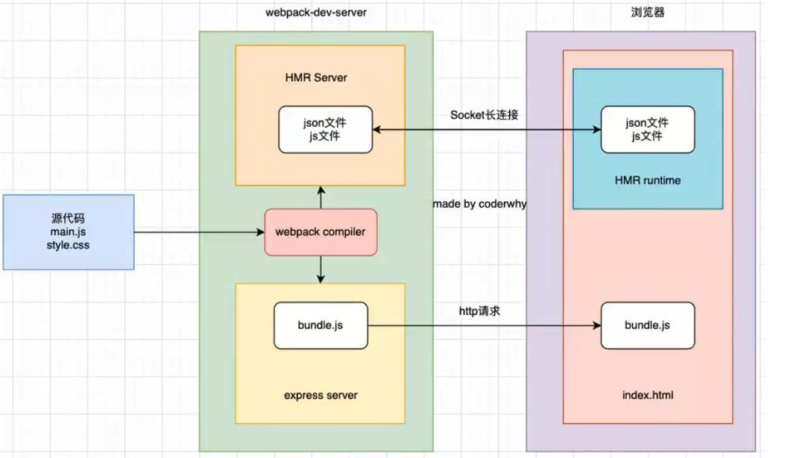

## 搭建本地服务器
在没有搭建本地服务器之前，我们为了在浏览器中看到代码成果，一般是这样操作的：
1. 执行npm run build打包命令，将编译后的文件打包到dist目录
2. 借助于Vscode中的live server插件，打开index.html文件查看效果

但是以上这种操作会有一个弊端：那就是在我们每次修改源代码之后，都需要手动再去执行npm run build打包命令，如果是一个很大的工程项目，每次打包都得花费很长的时间来进行打包。我们的需求是当源代码变化的时候，可以自动的感知到这种变化然后自动的编译和加载展示。目前webpack为我们提供了三种方案来自动编译打包：
1. webpack watch mode
2. webpack-dev-server
3. webpack-dev-middleware


## webpack watch mode
在webpack的watch模式下，webpack依赖图中的所有文件变化都会自动的进行编译打包，开启watch模式有两种方法：

1. package.json中添加watch脚本
当执行npm run watch的时候，每次源代码的变化webpack都会找到webpack.config.js中的配置并重新编译打包。
```json
"scripts": {
	"build": "webpack --config ./config/webpack.config.js",
	"watch": "webpack --watch --config ./config/webpack.config.js",
},
```
2. webpack.config.js中配置watch属性
```js
module.exports = {
	watch:true,
}
```

## webpack-dev-server
开启watch模式虽然可以在一定的程度上避免我们频繁的手动执行npm run build来打包，但watch模式还是有一定的缺点：
1. 每次源文件变化后都会对整个webpack依赖图中的代码进行全部的编译打包
2. 需要借助于IDE比如Vscode插件live server，这不是webpack提供的能力这是Vscode提供的能力
3. 每次编译打包都会生成新的bundle.js文件，都需要进行文件的写入操作，将打包后代码写入到dist目录下
4. live server每次都会重新刷新整个页面，不利于维护页面的状态

如果我们想不借助于Vscode的live server插件，而是基于webpack提供的能力来实现自动编译打包并实时重新加载(live reloading)刷新浏览器页面的话，就要使用webpack-dev-server这个工具来实现。

首先安装webpack-dev-server：
```bash
npm i webpack-dev-server -D
```

在package.json中配置serve脚本：
```json
"scripts": {
	"build": "webpack --config ./config/webpack.config.js",
	"watch": "webpack --watch --config ./config/webpack.config.js",
	"sever": "webpack serve --config ./config/webpack.config.js"
},
```

然后运行npm run serve命令，webpack-dev-server(以下简称WDS)会启动一个本地服务localhost:8080,一旦有任何依赖图中文件变化，都会实时编译并重新加载浏览器页面。
访问本地服务的8080端口，就等于打开本地服务器上的index.html页面，在当前页面的console控制台中有下面两句：
```js
[HMR] Waiting for update signal from WDS...  // 等待接收WDS更改的信号
[webpack-dev-server] Hot Module Replacement enabled.  // WDS的模块热更新开启！
[webpack-dev-server] Live Reloading enabled.  // WDS的实时重新加载开启！
```

### WDS和watch模式的区别
WDS和watch模式有一个重大的区别那就是：WDS每次监听都源文件的变化并重新编译之后，并不会将生成的新的文件写入到本地文件中，而是将编译打包之后的结果存在内存memory中，相比于watch模式下每次打包都生成新的文件并写入到本地，WDS在性能上是要比watch模式好的，因为文件写入是比较消耗性能的。

事实上，WDS使用了一个名叫memfs的库来实现将每次打包后的bundle文件保留在内存中的，可以在webpack自身的package.json中找到这个库，还有一个验证方法就是可以直接删除bundle文件夹，然后运行npm run serve会发现WDS不会在本地目录中生成任何新的文件，但是页面依旧保持正常，这就是因为WDS将打包后的bundle文件夹放在了内存中而不是写入本地文件夹里面。


## webpack-dev-middleware
使用webpack-dev-server来实现自动编译并实时重载的流程是：
1. webpack-dev-server基于express库提供的能力搭建了一个http本地服务
2. 将webpack打包之后的文件放在本地服务器上
3. 浏览器请求本地服务器上的资源并在页面展示

其实这里的核心就是express可以启动一个本地服务，其实除了这种方法之外，我们还可以使用webpack-dev-middleware这种方法来手动实现一个本地服务(可以是http模块、express或者koa),然后将webpack编译之后的结果实时重载到页面。这里我们还是以express来快速的搭建本地服务：

1. 安装webpack-dev-middleware和express
```bash
npm i webpack-dev-middleware express -D
```

2. 新建一个server.js，之后我们用node来加载这个文件

```js
const webpackDevMiddleWare = require('webpack-dev-middleware');
const express = require('express');
const webpack = require('webpack');

// 读取webpack配置文件
const webpackConfig = require('./config/webpack.config.js');
// 生成compiler
const compiler = webpack(webpackConfig);

// 生成express的中间件
const middleWare = webpackDevMiddleWare(compiler);

const app = express();
app.use(middleWare);

// 开启端口监听
app.listen(5500,()=>{
	console.log('express服务已经运行在5500端口！')
})
```

3. node执行server.js，在浏览器的localhost:5500端口就可以访问到编译之后的文件，但是不支持实时重载，需要手动刷新浏览器页面。

## 认识模块热替换(HMR)
HMR的全称叫做Hot Module Replacement，翻译过来就是模块热替换或者模块热更新，指的是在应用程序运行的过程中，模块的添加、替换和删除都不会重新刷新整个页面，而只是刷新发生变化的那一个模块。需要注意的是，HMR和Live Reloading是不同的概念，后者代表的意思是实时重载，意思是只要编译打包之后的依赖图中的代码发生变化都会实时的刷新浏览器页面。

HMR有以下几个好处：
1. 开启HMR不会重新加载整个页面，可以保留应用程序在运行时候的某些状态不丢失。因为浏览器重新刷新页面意味着要重新发起新的HTTP请求，服务器需要对请求作出响应，浏览器拿到资源之后还需要重新加载一遍代码，有的时候还需要重新跑一遍渲染流水线，这对于提高开发的效率是不好的。

2. 在修改了js和css代码的时候，HMR会立即在浏览器中更新，相当于在浏览器的devTools里面调试一样快速，可以大大的提高开发效率

从webpack-dev-server v4.0.0 开始，HMR是默认就开启的，如果webpack-dev-server包是v4.0版本以下，则需要我们手动在webpack.config.js中配置来开启HMR：
```js
module.exports = {
	devServer:{
		hot:true  // 开启模块热更新
	}
}
```

在开启HMR之后，重新运行npm run serve，本地服务起来之后，可以看到浏览器控制台有如下输出：
```bash
[HMR] Waiting for update signal from WDS...  
[webpack-dev-server] Hot Module Replacement enabled.  // 已激HMR
[webpack-dev-server] Live Reloading enabled. // 已激活实时重载
```

但是这里要注意一点，在开启HMR之后要想其生效，还需要在webpack的入口文件处告诉webpack dev serve哪些模块发生变化的时候使用HMR，如果不声明的话就算配置了HMR，那么默认还是会全部刷新浏览器页面的，这一点要特别注意：
```js
// 入口文件 index.js
if(module.hot){
	/**
	 * @params filepath 要热更新的模块文件路径
	 * @params callback 该模块热替换之后的回调函数
	 * */
	module.hot.accept('./utils.js',()=>{
		console.log('utils模块热更新！！');
	});
}
```

在经过以上的配置和声明热更新模块之后,我们修改utils模块中的代码，那么浏览器不会重新刷新整个页面，最好的证明就是原本在console控制台的输出并不会消失，而是继续在下面打印新的内容，这代表HMR是生效的，因为如果是重新加载整个页面那么console控制台的输出会全部重新打印:
```js
[webpack-dev-server] Hot Module Replacement enabled.
utils.js:551 [webpack-dev-server] Live Reloading enabled.
utils.js:551 [webpack-dev-server] App updated. Recompiling...
utils.js:551 [webpack-dev-server] App hot update...
log.js:24 [HMR] Checking for updates on the server...
main.js:20 utils模块热更新！！
log.js:24 [HMR] Updated modules:
log.js:24 [HMR]  - ./src/utils.js
log.js:24 [HMR] App is up to date.
```

## 使用React开发时开启HMR
在当前前端使用React框架进行开发的时候，如果我们想修改了一个组件只对当前组件代码进行重新加载，对其他组件不进行更新，也就是组件的HMR，该怎么办呢？
事实上，React官方的脚手架中就基于react-refresh这个库实现了对于React组件的HMR，也就是说使用create-react-app搭建的项目是默认自带HMR的，但是如果使我们想自己搭建一个React项目开启HMR的话，需要借助于插件和依赖完成。

1. 安装插件和依赖
```bash
npm install @pmmmwh/react-refresh-webpack-plugin -D  
npm install react-refresh -D
```

2. 在webpack.config.js中配置
注意：ReactRefreshWebpackPlugin只能在开发环境使用，如果要打包的话要删除 在生产环境是不能用的
```js
// 引入插件
const ReactRefreshWebpackPlugin = require('@pmmmwh/react-refresh-webpack-plugin');

module.exports = {
	module:{
		rules:[
			{
				test: /\.jsx?$/,
				exclude: /node_modules/,
				use: ["babel-loader"],
			},
		]
	},
	plugins: [
		// 应用插件
		new ReactRefreshWebpackPlugin(),
	],
}
```

3. 在babel.config.js中配置插件react-refresh
由于React代码都是由jsx实现的，而jsx语法在webpack中是经过bable-loader来处理的，而react-refresh就是一个专门为babel实现的插件
```js
module.exports = {
	presets:[
		["@babel/preset-env",{
			useBuiltIns:"usage", // 按需加载polyfill
			corejs:"3.21"
		}],
		["@babel/preset-react"],
	],
	plugins:[
		// 使用插件
		["react-refresh/babel"]
	]
}
```

4. 写一个React组件并导出
注意：这里必须导出组件，然后在入口文件处引入组件，才会有组件HMR的效果，否则是无法生效的！！！
```jsx
import React,{Component } from 'react';
import ReactDom from "react-dom";

class App extends Component {
	constructor(props) {
	    super(props);
		this.state = {
			message:"hello worldaaa"
		}
	}
	
	render(){
		return(<div>{this.state.message}</div>)
	}
}
export default App;
```

5. 入口文件处导入组件并渲染
```js
// 入口文件main.js

import ReactDom from "react-dom";
import React from 'react';
import App from './react/index.jsx'

// 加载组件并挂载到app上
ReactDom.render(<App/>,document.getElementById('app'));
```

修改组件中的内容，会发现浏览器不会重新刷新页面，而是只刷新了组件,很明显的一点就是浏览器左上角的刷新按钮没有发生刷新，只是重新加载了组件。
```bash
[HMR] Checking for updates on the server...
log.js:24 [HMR] Updated modules:
log.js:24 [HMR]  - ./src/react/index.jsx
log.js:24 [HMR] App is up to date.
index.js:551 [webpack-dev-server] App updated. Recompiling...
index.js:551 [webpack-dev-server] App hot update...
log.js:24 [HMR] Checking for updates on the server...
log.js:24 [HMR] Updated modules:
log.js:24 [HMR]  - ./src/react/index.jsx
log.js:24 [HMR] App is up to date.
```
## 使用Vue开发时开启HMR
在开发Vue项目的时候如果要开启HMR的话是很简单的，因为vue-loader就自带了开箱急用的Vue组件的模块热更新，只要在webpack.config.js中配置vue-loader即可：
```bash
npm i vue-laoder vue-template-complier -D
```

```js
const { VueLoaderPlugin } = require('vue-loader');
module.exports = {
	module:{
		rules:[
			{
				test: /\.vue$/,
				use: "vue-loader"
			},
			{
				test: /\.less$/,
				use: [
					"style-loader",
					{
						loader: "css-loader",
						options: {
							importLoaders: 2
						}
					},
					"postcss-loader",
					"less-loader",
				]
			},
		]
	},
	plugins: [
		new VueLoaderPlugin(),
	],
}
```

在入口文件处导入App.vue即可：
```js
// Vue3.0写法
import {createApp} from 'vue';
import App from './App.vue';
createApp(App).mount('#root')
```

## 模块热替换HMR的原理

HMR是如何做到只更新模块内容的变化而不刷新整个浏览器的呢？

这是因为webpack-dev-serve在工作的时候会创建两个服务：
1. 基于express创建的提供静态资源的服务
2. 基于web Socket创建的实时通信服务(net.Socket)

当我们将源代码首次打包编译之后，会将打包之后的bundle文件夹放在express创建的服务上，然后浏览器访问localhost:8080端口就会发起HTTP请求，express创建的静态资源服务器作出响应，将浏览器请求的资源返回，浏览器拿到这些资源之后进行解析和加载，这就是我们首次启动页面的时候的webpack dev server为我们做的事情。

当模块中的某个地方发生变化的时候，由于开启了HMR，HMR是一个Socket server，它是一个socket的长连接服务，意味着建立连接之后客户端和服务器之间可以互相通信，服务器可以直接发送资源到浏览器。当HMR服务监听到对应的模块发生变化的时候，会生成两个文件:
1. manifest.json:用于描述模块的哪些地方发生了变化的信息
2. update chunk：发生更新的模块代码

然后基于长连接将这两个文件主动的推送给客户端浏览器，浏览器在接受到这两个新的文件之后，通过HMR runtime机制，加载这两个文件，并且针对修改的模块进行更新，所以之前加载过的静态资源不会重新请求一遍并加载，浏览器也就不会刷新整个页面，而是只对变化的模块进行加载，这就是HMR实现的原理。

## devServer的配置项
注意：所有devServer的配置项都是针对于开发过程中的一些配置。
### hot
hot选项用来指定是否开启HMR以及如何开启。
1. 值为true，代表开启HMR。
值得注意的是在webpack-dev-server的4.0+版本开始，HMR是默认开启的，所以无需我们手动开启了。
2. 值为only
默认情况下源代码编译出错，修复错误后重新编译成功之后会刷新整个浏览器页面，代表重新加载所有代码
当值为only的时候，修复错误重新编译之后只刷新出错的那个模块代码，不会重新刷新整个浏览器页面

### host
host选项用于设置WDS启动的本地服务器的主机地址
1. 默认值为localhost
localhost本质代表一个域名，通常情况下会被解析为127.0.0.1，也就是回环地址(Loop Back Address)。意思就是我们自己主机发出去的包直接被自己接收。
一般情况下正常的数据包传输是应用层-传输层-网络层-数据层-物理层，而回环地址发出去的包会在网络层就被捕获到，是不会经过数据层和物理层的。所以当我们监听127.0.0.1的时候，在同一个网段下的主机中通过ip地址是不能访问的。

2. 如果设置值为0.0.0.0
代表监听IPV4上所有的地址，再根据端口号找到不同的应用程序。因此监听0.0.0.0的时候，在同一个网段下的主机通过ip地址是可以访问的。

### port
port选项用于设置本地服务的端口号，默认值是8080。

### open
open选项用于设置是否每次编译成功之后自动打开浏览器
默认值是false也就是不打开
可以设置布尔值true默认打开浏览器，还可以设置浏览器应用程序名称google-chrome等打开对应的浏览器

### compress
compress选项用于设置是否为静态文件开启gzip压缩
默认值是false也就是不压缩
设置为true代表在浏览器请求本地服务器上静态文件的时候开启gzip压缩，可以提高开发时的效率。

### proxy
proxy选项主要用来解决在项目的开发阶段通过设置代理来解决前后端跨域请求的问题。

比如当前前端项目是run serve之后，浏览器在获取项目打包之后静态资源的时候其实是向域名为：http://localhost:8080端口的本地静态资源服务器发起的请求，但是如果我们想在项目中请求后端的API接口的时候，比如后端的服务器地址为：http://127.168.15.12:5500,此时当浏览器发起http网络请求的时候就会出现跨域请求而无法访问的错误，这是因为浏览器的同源策略限制的，因为浏览器只允许对相同域名、端口号和协议的服务器发起请求，然而项目中请求的服务器一个是localhost:8080，另外一个是http://127.168.15.12:5500，因此浏览器会报跨域。

为了解决跨域问题，首先要明确一个解决的思路，因为同源策略仅仅是限制浏览器端不能在同一页面向不同源的服务器发起请求，如果我们设置一个代理服务器，将所有浏览器发出的请求都先发到这个代理服务器上，然后由这个代理服务器发起请求去不同的源获取数据，然后将获取的数据返回给浏览器，这样就等于绕开了浏览器的同源策略的限制，因为服务器端是没有同源限制的。

在浏览器中直接发起对一个非同源服务器API data接口的请求：
```js
axios.get("http://127.168.15.12:5500/data").then(res=>{
	console.log(res);
}).catch(err)=>{
	console.log(err);
}
```
此时由于跨域，浏览器会报跨域错误。

#### target属性
为了解决这个问题我们配置一个proxy代理：
```js
devServer:{
	proxy:{
		"/kai":{
			target:"http://127.168.15.12:5500",
		}
	}
}
```
以上配置代表所有浏览器发起的请求URL中包含"/kai"的话，webpack dev server就会通过一系列操作将这个请求转发到目标服务器"http://127.168.15.12:5500"上。

因此，配置了proxy之后，我们就需要修改下我们的请求路径为"/kai/data",这样子请求路径中就包含了"/kai"才会被转发到目标服务器：
```js
axios.get("/kai/data").then(res=>{
	console.log(res);
}).catch(err)=>{
	console.log(err);
}
```
再次发起请求之后发现不会报跨域错误的，但是会报一个404资源找不到的错误。这是因为当浏览器在发起请求的时候，由于当前的请求路径是"/kai/data",浏览器就会自己在前面加上协议和域名，所以此时实际的完整请求URL是：
```bash
http://localhost:8080/kai/data
```
由于我们配置了代理proxy中的target:"http://127.168.15.12:5500"，所以代理服务器会将"http://localhost:8080/kai/data"请求映射为：
```bash
http://127.168.15.12:5500/kai/data
```
然而实际请求的资源其实是存放在"http://127.168.15.12:5500/data"上的，由于请求路径中多了一个/kai，所以服务器找不到资源返回了404。现在的问题是在请求发出前将"/kai"去掉，这样子就可以了，这个需求可以通过pathRewrite选项来配置

#### pathRewrite属性
```js
devServer:{
	proxy:{
		"/kai":{
			target:"http://127.168.15.12:5500",
			pathRewrite:{
				"^/kai":""
			}
		}
	}
}
```
以上配置代表所有以"/kai"开头的请求在转发到目标服务器之前，将/kai替换为空字符串，这样以来最后发起的请求路径就符合要求，返回正常结果。
```bash
http://127.168.15.12:5500/data
```

#### secure属性
默认情况下，WDS不接受转发到HTTPS的服务器上，如果希望支持，需要设置secure为false也就是关闭HTTPS检查。
```js
devServer:{
	proxy:{
		"/kai":{
			target:"http://127.168.15.12:5500",
			pathRewrite:{
				"^/kai":""
			},
			secure:false
		}
	}
}
```
#### changeOrigin属性
除此之外，常见的配置proxy的时候还会有一个changeOrigin属性，它表示是否更新代理请求中的headers中的host地址。

如果不配置changeOrigin属性：那么目标服务器接收到的请求的来源就是"http://localhost:8080"；如果目标服务器127.168.15.12:5500不对所有请求的源做校验的话，那么可以不配置changeOrigin属性，但是如果目标服务器开启了对于请求源校验的话，也就是如果请求路径中的域名不是127.168.15.12的话，那么就拒绝这次请求。

所以为了避免目标服务器做来源校验而请求失败的问题，我们需要将changeOrigin设置为true，代表最后真实的发送给目标服务器的请求中其请求地址是目标服务器的域名，而不是localhost：8080。
```js
devServer:{
	proxy:{
		"/kai":{
			target:"http://127.168.15.12:5500",
			pathRewrite:{
				"^/kai":""
			},
			secure:false,
			changeOrigin:true
		}
	}
}
```
注意：WDS在实现Proxy的代理功能的时候，其实是用了现成的http-proxy-middleware和http-proxy两个库来实现的。

#### historyApiFallback属性
historyApiFallback选项主要用于解决在SPA单页面应用中，当路由发生跳转之后如果刷新页面，报404错误的问题。
不管是Vue还是React项目，先在一般都是SPA单页面应用，所以使用的都是前端路由。前端路由的核心原理就是监听浏览器地址栏的路由变化，然后执行相应的js代码最后渲染不同的组件。但是如果在History路由模式下我们切换了路由后又刷新了页面，此时浏览器会认为是去服务器获取对应的资源，所以就会报404的错误。

此时，我们只需要配置devServer中的historyApiFallback属性为true即可解决这个问题，因为默认情况下开启之后如果服务器找不到资源就会将打包之后的index.html文件返回给浏览器，此时浏览器获取到html文件就不会报错了：

```js
devServer:{
	historyApiFallback:true  
}
```
当然historyApiFallback的值可以是一个布尔值，还可以是一个对象，如果是一个对象的话需要设置rewrites来设置一到多个不同路径要返回不同页面的配置：
```js
devServer:{
	historyApiFallback: {
	      rewrites: [
	        { from: /^\/$/, to: 'index.html' },  // 当刷新的页面路径为/的时候，默认返回index.html
	        { from: /^\/subpage/, to: 'subpage.html' }, 
	        { from: /./, to: '404.html' }, // 页面路由为任意组合值的时候，返回404.html
	      ],
	    },
}
```
设置这些不同的html的前提是打包之后的文件夹中必须包含这些html页面
